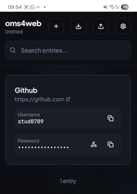

# Getting Started

*oms4web* is a password manager tightly integrated with *OneMoreSecret*. It's a responsive app, so you can use it on your desktop and on your mobile.
-  on the decktop, the app will show QR-code sequences for encrypted content
- on your Android device, oms4web will trigger *OneMoreSecret* and transfer the data

*oms4web* cannot read the passwords on its own. It will know your user name and other unencrypted stuff though.  

The icon  will trigger *OneMoreSecret* if smth. needs to be decrypted.

## WARNING
*oms4web* runs locally on your device, be it a desktop computer or a mobile. The data is stored in the browser's IndexDB, bad things can happen anytime. So..

⚠️ BACKUP YOUR DATA ⚠️

You can do it at any time using the download button. You can also upload your backup with the upload button. Cross-device sync is out of scope at the moment. 

## Setting things up
Go to the ⚙️ settings dialog. The most important step is providing the public key. The public key export is described in *OneMoreSecret* [documentation](https://github.com/stud0709/OneMoreSecret/blob/master/key_management.md). TLDR: 
- go to ⋮ -> Settings -> Private Keys
- long-press private key entry in the list
- on Android: copy&paste it, on desktop: have *OneMoreSecret* [auto-type](https://github.com/stud0709/OneMoreSecret/blob/master/autotype.md) it.

You can use the app without public key as well. In this case, the in-place encryption will not be available. For password field, you will only be able to enter already encrypted data [generated](https://github.com/stud0709/OneMoreSecret/blob/master/password_generator.md) by *OneMoreSecret* into the field (oms00_....). Your password database as a whole will not be encrypted either.

## Note on password generator and encryption
Technically, if you generate passwords in oms4web, they will be only encrypted on save. If you don't want that, do not enable password generator in the settings and generate your passwords in *OneMoreSecret*. 

## One last tip
Consider installing *oms4web* as an [web app](https://support.google.com/chrome/answer/9658361?hl=en&co=GENIE.Platform%3DDesktop). This makes it more convenient to use and allows tighter integration with the operation system.

You might also want to have a look at the [README](./README.md) file.