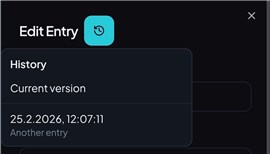

# Entry History

Each password entry keeps a history of previous versions. This lets you review older versions of the entry from within the edit dialog.

The history menu is shown in the entry form header (next to the dialog title).

- **Current version**: switches back to the editable current entry data.
- **Historical version**: loads the selected snapshot into the form in read-only mode.

You cannot modify history entries, they are for your reference only.
