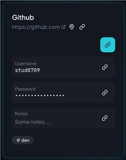
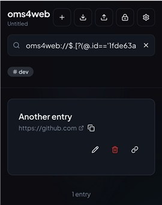

# Reference to another entry

oms4web lets you store a field as a reference to another entry instead of duplicating the value. The reference is stored as a special URL-like string and resolved when the entry is displayed.

## What a reference looks like

References start with the `oms4web://` prefix and use a JSONPath expression to point to another entry field:

```
oms4web://$.[?(@.id=='<entry-id>')].username
```

The path is evaluated against the list of entries in the vault. When the reference resolves, the referenced value is shown in the UI. If it cannot be resolved, the UI shows `(invalid reference)`.

Custom field references preserve the original protection mode of the referenced field. Link chaining is not supported.

## Creating a reference from the UI

1. Open the entry card you want to reference from.
2. Click the **link** icon   to toggle **reference mode**. 



3. Use the **copy reference**  button next to a field (URL, username, password, notes, or a custom field).
4. Paste the reference into another entry field instead of a literal value. Save.

## Finding the source of a link

If a field already contains a reference, the **pin icon**  appears in reference mode and lets you locate the source entry (it updates the search filter with the source entry id).


